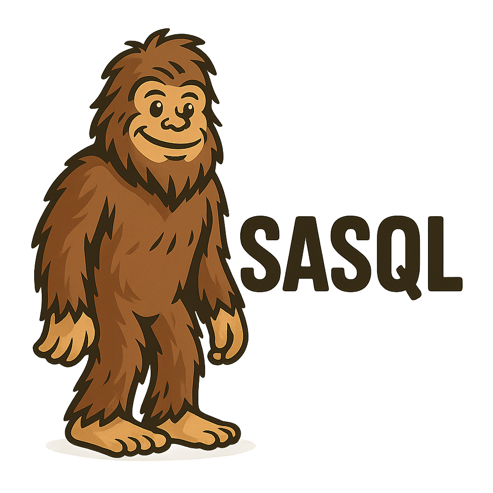

# SASQL Core

SASQL is a SQL extension language that enables modular SQL development with reusable components. This repository contains the core compiler, parser, and VS Code extension for the SASQL language.

<div style="width:100%;display:flex;justify-content:center;">
</img>
</div>

## Overview

SASQL enhances standard SQL by adding directives like `@use`, `@statement`, and `@include` that enable:

- **Modular SQL**: Break complex SQL into reusable components
- **Import/Export**: Reference SQL modules across files
- **Documentation**: Structured documentation using JSDoc-style comments
- **Parameterization**: Define parameters for SQL statements
- **IntelliSense**: Smart autocompletion in VS Code

## Project Structure

The repository is organized into the following components:

- **Core Library**: Parser, tokenizer, and compiler for the SASQL language
- **CLI**: Command-line interface for SASQL operations
- **VS Code Extension**: Language server and client providing editor features:
    - Syntax highlighting
    - Code completion
    - Hover documentation
    - Error validation
    - Navigation

## Getting Started

[Installation and usage instructions will be added here]

## Example

```sql
// file: my-statement.sasql
/**
 * Query to select data from my_table with filters
 * @param {string} $1 The first parameter
 * @param {string | number} $2 The second parameter
 */
@statement select_from_my_table {
    SELECT
        *
    FROM
        my_table
    WHERE
        column_a = $1
        AND column_b = $2
}

// file: entry.sasql
@use './my-statement' as my_statement;

SELECT
    *
FROM
    (
        @include my_statement.select_from_my_table;
    ) as my_statement
```

## Author

Created by Alexander Porrello
